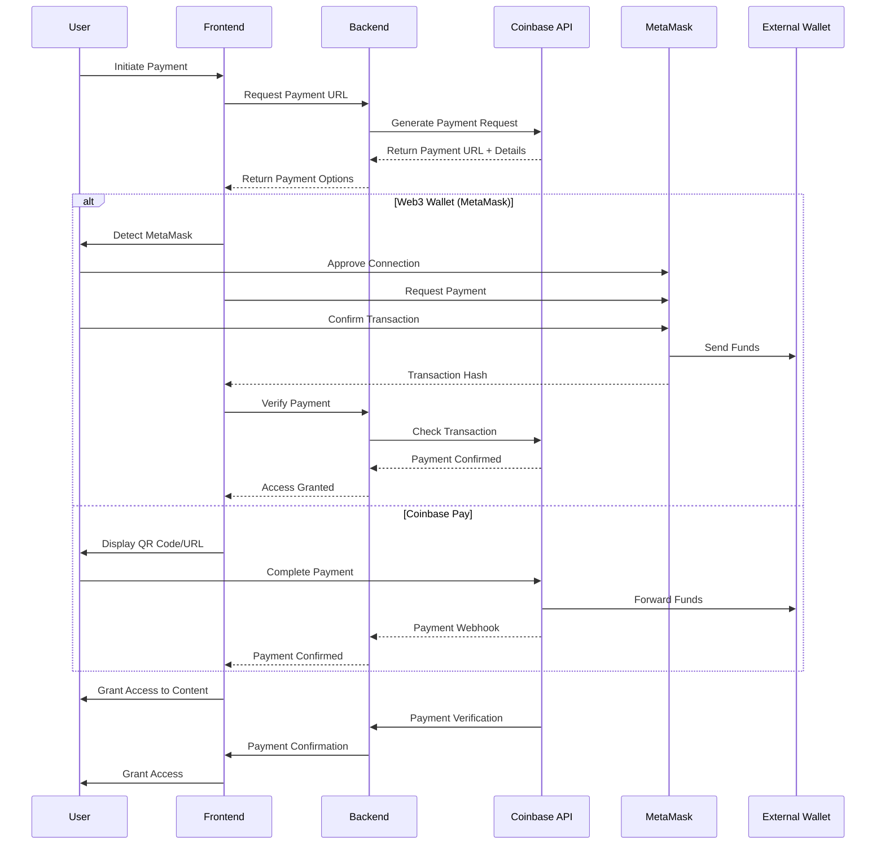

# Payment Integration Documentation

## Overview
This document outlines the payment flow for the x402 integration, which uses Coinbase's payment verification while directing funds to an external wallet.

## Architecture



## Environment Variables

### Required
- `COINBASE_API_KEY`: Your Coinbase Commerce API key
- `EXTERNAL_WALLET_ADDRESS`: The wallet address to receive payments
- `SENSAY_API_KEY`: Your Sensay API key
- `SENSAY_ORG_ID`: Your Sensay organization ID
- `SENSAY_REPLICA_ID`: Your Sensay replica ID

### Optional (with defaults)
```bash
COINBASE_API_URL=https://api.cdp.coinbase.com
X402_PAYMENT_AMOUNT=0.01
X402_ASSET=usdc
X402_CHAIN=base
X402_PAYMENT_EXPIRY=3600  # 1 hour
EXTERNAL_WALLET_NETWORK=base
```

## Payment Flow

1. **Initiation**:
   - User requests a service that requires payment
   - Frontend calls `/api/payments/initiate`
   - Backend generates a payment URL and QR code

2. **Payment**:
   - User scans QR code or clicks payment link
   - User approves transaction in their wallet
   - Funds are sent directly to external wallet
   - Coinbase verifies the payment

3. **Verification**:
   - Backend verifies payment with Coinbase
   - Session is updated with payment status
   - User gains access to the service

## QR Code Implementation

The system generates a QR code containing:
- Payment amount
- Asset type
- Destination address
- Network
- Optional: Payment reference/memo

## Security Considerations

1. Always use HTTPS
2. Validate all payment callbacks
3. Implement rate limiting
4. Store minimal payment data
5. Use environment variables for sensitive data

## Error Handling

The system handles:
- Insufficient funds
- Network congestion
- Expired payments
- Invalid payment proofs

## MetaMask Integration

### Frontend Implementation

1. **Check for MetaMask**
   ```javascript
   // Check if MetaMask is installed
   if (typeof window.ethereum !== 'undefined') {
     console.log('MetaMask is installed!');
   } else {
     // Handle case where MetaMask is not installed
     console.log('Please install MetaMask!');
   }
   ```

2. **Connect to MetaMask**
   ```javascript
   async function connectMetaMask() {
     try {
       // Request account access
       const accounts = await window.ethereum.request({ method: 'eth_requestAccounts' });
       const account = accounts[0];
       console.log('Connected account:', account);
       return account;
     } catch (error) {
       console.error('User denied account access');
       return null;
     }
   }
   ```

3. **Send Payment**
   ```javascript
   async function sendPayment(recipient, amount) {
     try {
       // Convert amount to wei (18 decimal places)
       const amountInWei = window.web3.utils.toWei(amount.toString(), 'ether');
       
       // Send transaction
       const txHash = await window.ethereum.request({
         method: 'eth_sendTransaction',
         params: [{
           from: accounts[0],
           to: recipient,
           value: amountInWei,
           gas: '21000', // Standard gas limit for simple transfers
         }],
       });
       
       console.log('Transaction hash:', txHash);
       return txHash;
     } catch (error) {
       console.error('Payment failed:', error);
       throw error;
     }
   }
   ```

### Backend Verification

1. **Verify Transaction**
   ```javascript
   const Web3 = require('web3');
   const web3 = new Web3(process.env.INFURA_URL);
   
   async function verifyTransaction(txHash, expectedRecipient, expectedAmount) {
     try {
       // Get transaction receipt
       const receipt = await web3.eth.getTransactionReceipt(txHash);
       
       if (!receipt || !receipt.status) {
         return { success: false, error: 'Transaction failed or not found' };
       }
       
       // Get transaction details
       const tx = await web3.eth.getTransaction(txHash);
       
       // Verify recipient and amount
       const amountInWei = web3.utils.toWei(expectedAmount.toString(), 'ether');
       
       if (tx.to.toLowerCase() !== expectedRecipient.toLowerCase()) {
         return { success: false, error: 'Incorrect recipient' };
       }
       
       if (tx.value !== amountInWei) {
         return { success: false, error: 'Incorrect amount' };
       }
       
       return { success: true };
     } catch (error) {
       console.error('Verification failed:', error);
       return { success: false, error: error.message };
     }
   }
   ```

## Implementation Details

### Development Tool Stack

#### Core Dependencies
- **Node.js**: Runtime environment
- **Express**: Web server framework
- **Axios**: HTTP client for API calls
- **dotenv**: Environment variable management
- **qrcode**: QR code generation
- **winston**: Structured logging

#### Development Tools
- **Nodemon**: Auto-reload for development
- **Mocha/Chai**: Testing framework
- **Sinon**: Test spies, stubs, and mocks
- **ESLint/Prettier**: Code quality and formatting

### Backend Endpoints

#### `POST /api/payments/initiate`
Initiates a new payment and returns payment details.

**Request:**
```json
{
  "amount": "0.01",
  "asset": "usdc",
  "chain": "base"
}
```

**Response:**
```json
{
  "status": "success",
  "data": {
    "paymentUrl": "https://pay.coinbase.com/...",
    "qrCode": "data:image/svg+xml;base64,...",
    "amount": "0.01",
    "asset": "usdc",
    "destination": "0x...",
    "expiresAt": "2023-01-01T12:00:00Z"
  }
}
```

#### `GET /api/payments/status/:paymentId`
Checks the status of a payment.

**Response:**
```json
{
  "status": "success",
  "data": {
    "status": "pending|completed|failed",
    "amount": "0.01",
    "asset": "usdc",
    "transactionHash": "0x..."
  }
}
```

### QR Code Generation

The system uses the `qrcode` npm package to generate QR codes. The QR code encodes a payment URL in the following format:

```
ethereum:0x1234...5678@1?value=10000000000000000&gas=21000
```

## Testing

### Test Environment
Set the following in your `.env.test`:
```bash
NODE_ENV=test
COINBASE_API_KEY=test_key
EXTERNAL_WALLET_ADDRESS=0x0000000000000000000000000000000000000000
```

### Running Tests
```bash
npm test
```

## Deployment

1. Set all required environment variables
2. Run database migrations (if any)
3. Start the server:
   ```bash
   npm start
   ```

## Monitoring

Monitor the following metrics:
- Payment success/failure rates
- Average payment processing time
- Failed payment reasons
- Wallet balance

## Troubleshooting

### Common Issues

1. **Payment Not Verifying**
   - Check Coinbase API status
   - Verify webhook URLs are correct
   - Check server logs for errors

2. **QR Code Not Scanning**
   - Ensure sufficient contrast
   - Verify URL encoding
   - Test with multiple wallet apps

3. **Transaction Stuck**
   - Check network congestion
   - Verify gas fees
   - Check wallet balance

## Development Workflow

### Setting Up Development Environment

1. Clone the repository:
   ```bash
   git clone https://github.com/your-org/sensayhack-402.git
   cd sensayhack-402
   ```

2. Install dependencies:
   ```bash
   npm install
   ```

3. Configure environment variables (copy from .env.example):
   ```bash
   cp .env.example .env
   # Edit .env with your configuration
   ```

4. Start the development server:
   ```bash
   npm run dev
   ```

### Testing

Run the test suite:
```bash
npm test
```

### Deployment

1. Set up production environment variables
2. Build the application:
   ```bash
   npm run build
   ```
3. Start the production server:
   ```bash
   npm start
   ```

## Support

For issues not covered in this document, please open an issue in our [GitHub repository](https://github.com/your-org/sensayhack-402/issues).
