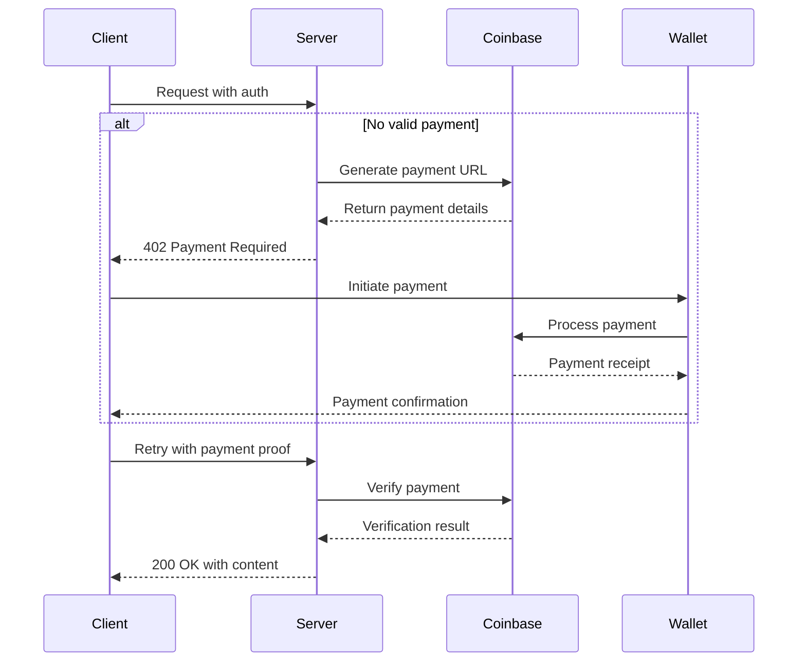

# x402 Integration Implementation Guide

This document provides detailed implementation guidance for the Coinbase x402 payment integration.

## Core Implementation

### 1. Payment Flow



### 2. Code Implementation

#### Payment Middleware

```javascript
// Middleware to check payment status
async function requirePayment(req, res, next) {
  const { userId } = req.session;
  const proof = req.headers['pay-proof'];
  
  try {
    // Check for valid payment session
    const paymentInfo = await paymentService.getPaymentStatus(userId);
    
    if (paymentInfo?.status === 'paid') {
      return next();
    }
    
    // Generate new payment request
    const paymentUrl = await coinbaseService.generatePaymentUrl(userId);
    
    return res.status(402).set({
      'Pay': paymentUrl
    }).json({
      status: 'payment_required',
      paymentUrl,
      message: 'Payment required to access this resource'
    });
    
  } catch (error) {
    next(error);
  }
}
```

### 3. Coinbase Integration

#### Generating Payment URLs

```javascript
async function generatePaymentUrl(userId, amount, asset = 'usdc') {
  const response = await axios.post(
    `${config.coinbase.apiUrl}/v1/payments`,
    {
      pricing_type: 'fixed_price',
      local_price: {
        amount: amount.toString(),
        currency: asset.toUpperCase()
      },
      name: 'Service Access',
      description: `Payment for service access (${userId})`,
      redirect_url: `${config.appUrl}/success`,
      cancel_url: `${config.appUrl}/cancel`
    },
    {
      headers: {
        'X-CC-Api-Key': config.coinbase.apiKey,
        'Content-Type': 'application/json'
      }
    }
  );
  
  return response.data.data.hosted_url;
}
```

### 4. Payment Verification

```javascript
async function verifyPayment(proof) {
  try {
    const response = await axios.get(
      `${config.coinbase.apiUrl}/v1/charges/${proof}`,
      {
        headers: {
          'X-CC-Api-Key': config.coinbase.apiKey,
          'Content-Type': 'application/json'
        }
      }
    );
    
    return response.data.data.status === 'CONFIRMED';
  } catch (error) {
    logger.error('Payment verification failed', { error });
    return false;
  }
}
```

## Testing the Integration

### Test Cases

1. **Happy Path**
   - User makes request without payment
   - Receives 402 with payment URL
   - Completes payment
   - Retries with payment proof
   - Receives content

2. **Invalid Payment**
   - User provides invalid payment proof
   - System rejects with appropriate error

3. **Expired Session**
   - User's payment session expires
   - System requests new payment

### Mocking Coinbase API

```javascript
// In test setup
beforeEach(() => {
  nock('https://api.coinbase.com')
    .post('/v1/payments')
    .reply(200, {
      data: {
        hosted_url: 'https://commerce.coinbase.com/checkout/123',
        id: 'payment_123'
      }
    });
    
  nock('https://api.coinbase.com')
    .get(/\/v1\/charges\/.+/)
    .reply(200, {
      data: {
        status: 'CONFIRMED',
        payment: []
      }
    });
});
```

## Security Considerations

1. **Rate Limiting**
   - Implement rate limiting on payment endpoints
   - Consider IP-based restrictions for repeated failures

2. **Data Validation**
   - Validate all payment-related inputs
   - Sanitize user-provided data

3. **Error Handling**
   - Use specific error types for different failure modes
   - Log detailed error information
   - Provide user-friendly error messages

## Monitoring and Logging

### Key Metrics to Track
- Payment success/failure rates
- Average payment processing time
- Common failure reasons
- Wallet connection success rates

### Logging Example

```javascript
logger.info('Payment initiated', {
  userId,
  amount,
  asset,
  timestamp: new Date().toISOString()
});
```

## Next Steps

1. **Review Security Guidelines**
   - Ensure all API keys are stored securely
   - Implement proper CORS policies
   - Set up monitoring and alerts

2. **Production Deployment**
   - Deploy to a secure environment
   - Set up SSL/TLS
   - Configure proper logging and monitoring

3. **Monitoring**
   - Set up alerts for failed payments
   - Monitor success rates and response times
   - Track user experience metrics

## Additional Resources

- [Coinbase Commerce API Documentation](https://commerce.coinbase.com/docs/api/)
- [x402 Protocol Specification](https://docs.cdp.coinbase.com/x402)
- [Example Implementation](https://github.com/coinbase/x402-examples)